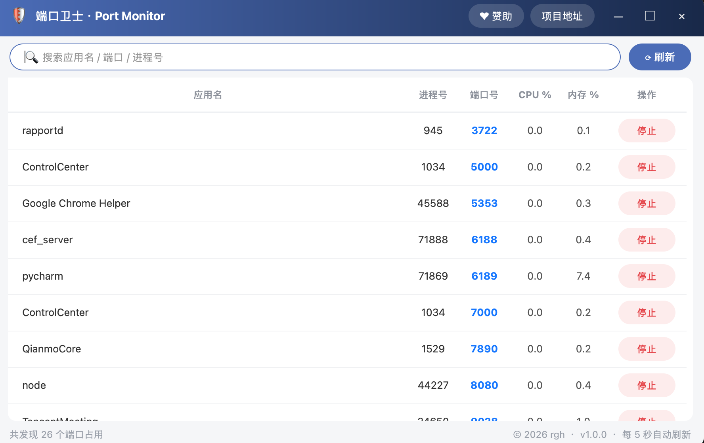

# 🛡 端口卫士 · Port Monitor

一款界面美观的跨平台桌面工具，用于**检测本机端口占用情况**并一键停止占用进程。


📖 [English](./README_en.md) · **简体中文**

## 📸 界面预览



## 💡 开发背景

在日常开发中，我们常遇到 IDE 或调试工具意外崩溃、终端进程卡死等情况，导致之前使用的端口未能正常释放，再次启动服务时就会报出 **`Address already in use`** 之类的错误。传统的解决方式是在命令行中敲一堆命令（`netstat -ano | findstr` → `taskkill /PID`），不仅步骤繁琐，还容易输错 PID。

为了让自己和团队伙伴能 **一键解决端口占用问题**，我开发了这款跨平台的桌面小工具。它图形化地展示所有监听的端口及其所属进程，点击“停止”就能瞬间清理占用，省去记忆命令的烦恼，让开发体验更顺畅。

## ✨ 功能

- 启动即扫描本机**正在监听的端口**（TCP LISTEN 与 UDP），表格展示：
  - 应用名 · 进程号(PID) · 端口号 · CPU 占用% · 内存占用% · 操作
- **操作栏「停止」按钮**：点击确认后杀死进程，成功后该进程占用的所有行立即从界面移除
- CPU/内存占用按热度着色（红/橙/灰），一眼看出资源大户
- 顶部搜索框：按应用名 / 端口 / 进程号实时过滤
- 每 5 秒自动刷新，也可手动点「刷新」
- **无边框圆角窗口 + 蓝色渐变标题栏**，自定义标题栏：
  - ❤ 赞助：弹出收款码，支持 **微信 / 支付宝 / QQ** 切换
  - 项目地址：跳转 GitHub 项目
  - 最小化 / 最大化 / 关闭
  - 标题栏可拖动、双击最大化/还原
- 无权限读取全局连接时自动降级为逐进程扫描，尽量列出当前用户可见的端口
- 跨平台：Windows / macOS / Linux（基于 `psutil`，无平台相关命令）

## 📥 下载可执行文件（无需 Python 环境）

前往 [Releases 页面](https://github.com/vfaner/port-monitor/releases/latest) 下载：

| 系统 | 文件 | 使用方式 |
|---|---|---|
| Windows 10/11 (x64)   | `PortMonitor-windows-x64.zip`  | 解压 → 双击 `PortMonitor.exe` |
| macOS (Apple Silicon) | `PortMonitor-macos-arm64.zip`  | 解压 → 双击 `PortMonitor.app`；首次被拦时右键 → 打开 |
| macOS (Intel)         | *（暂不提供预编译）*             | 请见下方「从源码运行」 |
| Linux (x64)           | `PortMonitor-linux-x64.tar.gz` | `tar xzf ...` → `./PortMonitor` |

> 双击即用，不需要装 Python 或任何依赖。
> **Intel Mac 用户**：由于 GitHub Actions 已逐步下架 Intel macOS runner，暂不提供预编译版，请从源码运行（步骤见下）。

## 🚀 从源码运行

```bash
pip install -r requirements.txt
python port_monitor.py
```

> 部分系统进程属于其他用户，扫描或停止时需要更高权限：
> - macOS / Linux：`sudo python port_monitor.py`
> - Windows：以管理员身份运行终端

## 💰 配置收款码

把真实收款码图片放入 `assets/` 目录（详见 `assets/README.md`）：
`wechat.png` / `alipay.png` / `qq.png`。未放置时显示占位图。

## 🔧 自定义

打开 `port_monitor.py` 顶部的配置区可修改：

```python
GITHUB_URL = "https://github.com/vfaner/port-monitor"  # 右上角跳转地址
APP_NAME   = "端口卫士 · Port Monitor"
```

## 📦 打包为可执行文件（可选）

```bash
pip install pyinstaller
pyinstaller -F -w --add-data "assets:assets" port_monitor.py   # macOS/Linux
pyinstaller -F -w --add-data "assets;assets" port_monitor.py   # Windows
```

## License

本项目基于 **Apache License 2.0** 开源，Copyright © 2026 rgh。

- ✅ 允许免费使用、修改、二次分发、商用
- ⚠️ 再分发时**必须保留** `LICENSE` 与 `NOTICE` 文件，其中包含作者署名（rgh）与项目地址
- ⚠️ 修改过的文件需注明改动

详见 [LICENSE](./LICENSE) 与 [NOTICE](./NOTICE)。
